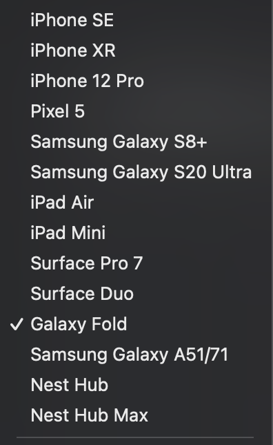
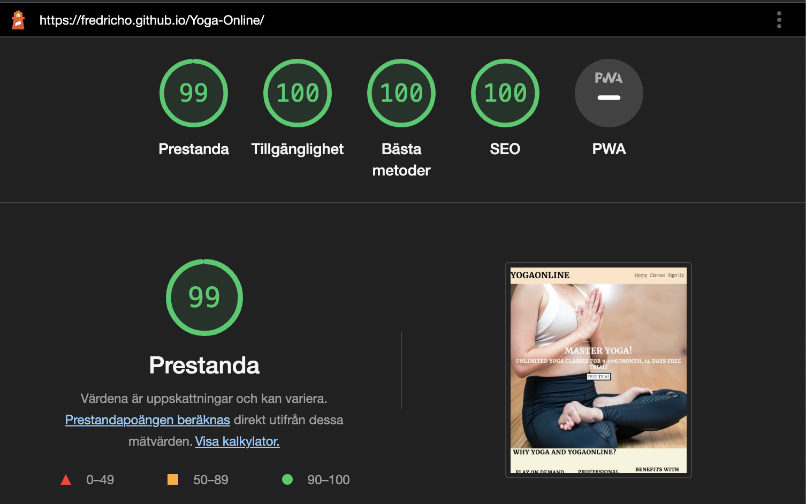

# YOGAONLINE

Yogaonline is a website that provides users with online classes of yoga in three different forms, Yin, Ashtanga and Hatha upon a subscription model of 9.99€/month, with a possible 14-day free trial. The goal of the site is to target people who wants to practice Yoga and make it available at all times from all around the globe. 

Welcome to YogaOnline: [YogaOnline](https://fredricho.github.io/Yoga-Online/)

## Wireframes

These wireframes are created in Balsamiq for the YogaOnline website, one for each page for full-size and mobile-size. There will be some adjustments to the final site, to make it as functional and good looking on all devices. 

  
    
   
   
   

## Site Structure
The YogaOnline website has three pages, Home, Classes and Sign Up, they are entered thru the naviagtion menu at the top of the page. There is also a link-button "Free Trial" that navigates the user to the sign up-page. 

## Design Choiches
  * ### Typography

  The chosen fonts for this website were ?Merriweather? for headings and ?Bitter? for body and back up font were sans-serif respectilvey. 
    * ?Merriweather? were choosen to give the user a warm and harmonic welcome to the site and a font that can be easily read. 
       * ?Bitter? were choosen to give a relaxed and calm impression to fit in to the Yoga content. 

* ### Color Scheme

The choosen color scheme for the site is there to create a warm and laid-back feeling to the users and to be quite minimalistic. To make the user get into the right state of mind which is Yoga. 

## Features
YogaOnline is developed to be easy navigated with a menu top right, footer in the bottom which is were the user expect it to be. The information is uncomplicated and there is just one step to Sign Up and to get access to the Classes, sent in an email. The site is supposed to be minimalistic and functional.

## Existing Features

  * ### Navigation Menu
    * The menu is positioned at the top of all pages and on all devices and is fully responsive to make it good looking to all type of screens. The logo is also clickable and links back to the homepage, which is another option for the user to navigate. 

    IMAGE of nav

  * ### Hero-section
    * Is located directly under the header and it contains a large hero image of a girl how practices Yogs and a text that explains the concept of the YogaOnlines subscription model even further. The image appearance changes slightly depending on what size it is being viewed on, but the main idea with the picture follows anyhow. 

  * ### Why YogaOnline section
    * Is based under the hero section and it contains three headings with a short paragraph to give the user a short brief of the classes, teachers and benefits with Yoga. 
    * Right under the paragraphs comes an image of a woman who practices yoga in a living room with a computer by her side and it gives the user a clear vision of how it might look when taking yoga classes online. 

   * ### Review-section
     * The review section is there to let the user see what other people think about YogaOnline and to hopefully make them more intrested in a subscription and learning yoga online. 

   * ### Footer-section
     * The footer sections holds a mail address, Facebook-, Instagram- ,YouTube-logo taken from fontawesome and copyright.
    
     * All of the links opens up in a new tab and the mail link open a mail.

     * It looks the same on all three pages and it's there to let the user connect and reach out to the site. 

* ## Classes - page
  * The classes page gives the user information about each form of Yoga that YogaOnline provides, which is Hatha, Yin and Ashtanga.
  * Each paragraph has a suitable image to rescpetively form, beside or underneath depending on the users device.
  * It's made to be both insperational and motivational to encourage the users to start practice Yoga. 

* ## Sign Up - page
* The last page of the site is the Sign Up - page and it conatins three input elements, Name, Last Name, Email and a submit button. Which will generate an email with deatails to contiune to the content and payment methods. 
* The background of the page is a video that is set to be auto played, muted and with controls, to give the user full control of the page. 
* It's a short video with a girl doing some Yoga out in the woods, with her hands up in the sky and against the sign up button.
* A text with some information before sign up is also on the page, to give the user an explanation of what to expect will happen after sign up. 

## Future Features
* To offer live online classes, both in group and indivudual classes with a scheme and a program that the user can follow for maximal progress. 
* A webshop with Yoga-essentials products, to become a fullservice site.
*  Some more videos, were the teachers can introduce themselves and the teqniques being tutored.
* Monthly meetups i diffrent places around the globe, to let the user have the possiblite to connect further. 

## Technologies Used
* HTML5 - Proides the structure for the site. 
* CSS - Provides the styling for the site. 
* Balsamiq - Used to make a sketch of the page. 
* Gitpod - Used to deploy the site. 
* Github - Used to host the site and make edits. 

## Testing 

## Code Validation

The site has gone through several test to minimize the risk of unwanted errors. All pages has been validated in W3C html Validator and the W3C CSS Validator. There were a few minor errors, such as no !DOCTYPE and some , after the test all of the errors were fixed. 

Images of the result in HTML validator, for each page:

* ### Home Page

* ### Classes page

* ### Sign Up page

### CSS Validator results:

## Responsiveness Test
* This test were made manually with Google Chrome Devtools, and all of the listed devices in devtools were checked.

Render, images, videos, links, pass on all devices listed on the image below.

   

## Browser Compatibility
* The YogaOnline site is tested on four diffrent browsers:

 Google Chrome - Pass, no visible errors or bugs and fully responsive.
 Apple Safari - Pass, no visible errors or bugs and fully responsive.
 Microsoft Edge - Pass, no visible errors or bugs and fully responsive.
 Mozilla Firefox - Pass, no visible errors or bugs and fully responsive.

 ## Known Bugs
 * Resolved
   * During the html validation a few bugs were shown:
     * No !DOCTYPE HTML, Open div tag, space between input attributes. These bugs were easily fixed!

* Unresolved - 0

## Additional Testing 

## Lighthouse
  * The site is tested with Google Chrome Lighthouse, the results is shown on the image below:
  
 